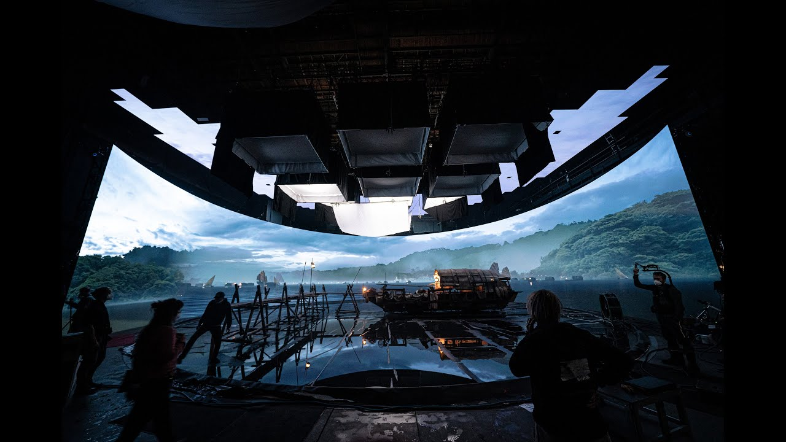

## Born an artist... or perhaps a programmer?

Growing up, I was surrounded by artists. Paintings, drawings, photos covered the walls of my house, with credit attributed to "Bercasio." Everyone in my family has a distinct skill in art, whether it be painting, drawing, photography, or cinematography. As a kid, I aspired to fill my own role in this apparent family pattern. But, I ended up finding my talent elsewhere; I was good at math. Combined with a mind more geared towards academics than anything else, I ended up liking science and technology more than art. I tried holding on to the idea of still being an artist, maybe a graphic designer or some other such role. By middle school, however, I settled on being a STEM kid. Specifically, I wanted to work with computers, since that was where I spent all my time anyways.

Time passed, and I still was very much a STEM kid in high school. I had involved myself in multiple science competitions, dipped my toes in robotics, and took classes in cybersecurity. On the idea of being a computer scientist, however, I was very much unsettled. Sure, I wanted to work with computers, but exactly how. Did I want to be a technician? A network specialist? A software engineer? I found myself leaning more towards software development, but that was not because it made a lot of money... it was because it was a creative pursuit. The artist in my heart fought back, and as I reflected on my skills and interests thus far, I wanted to do something creative with my career path. Combined with my first experiences of virtual reality and learning of the Mandalorian's "Volume" production set, I wanted to leverage my technical skills to create beautiful experiences as an artist.

## Technology as a Canvas

My main interest in computer science is enabling the creation of multimedia experiences such as video games and television/cinema, as well as newer experiences such as those in the realm of virtual and augmented reality. I also want to create those experiences myself, which may be a tall order to do in one life, but such ambition is a healthy thing. As it is related to software engineering, I want to get involved in developing open source tools like Blender and Godot, both of which serve as accessible alternatives to more expensive, and perhaps more controversy-wrought technology sets. Along with developing games using those tools, I want to learn how to give feedback on such large projects and make my own feature contributions to them. In particular, Godot's 3D capabilities are still woefully underdeveloped compared to Unity and Unreal, and it would be wonderful to learn how exactly to interact with that community and the codebase.

## Where University Comes into Play

In the near future, as a student, I plan to take classes that, as much as possible, relate to my overarching goals of creating experiences. In Software Engineering I, I hope to develop the basic skills associated with managing a software project, from the first seedlings of an idea to the finish line and beyond. In future classes, I hope to develop my proficiency with industry standard tools in animation and game development such as Unity, Unreal, and Maya. I also want to learn more about computer graphics specifically, and how you can create your own 3D engine or program procedural textures and other such tools that ease the workload of an artist. And on my own time? I want to make games! I want to draw, I want to write, I want to design something that someone can play and actually enjoy. Because, really, what's the point of an experience if it does not invoke emotion? Through my work in technology, and in art, I hope to create an experience that people will rememeber and, ultimately, be inspired by much like I was long ago.
