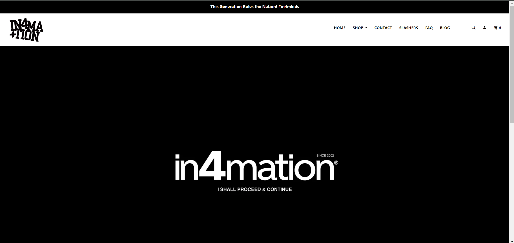

## The Chase of Beauty

The art of making a website is a nascent one, having only really begun on the very trailing edge of the last century. Yet, there has been much evolution since then. Long gone are the static webpages of yore, with their clashing colors and boring fonts; websites with responsive user interfaces (UI), edge-to-edge visuals, and animations are all the rage. Now, our standards are much higher, yet the amount of time we have to make these websites stays the same. What is a poor web developer to do in such a situation? This is where UI frameworks come into play. UI frameworks offer devs a 'streamlined experience' by providing multiple CSS classes that do most of the heavy-lifting when it comes to styling a website. Bootstrap is one example of such a framework, offering devs the ability to do things like divide up content into containers with rows and columns, as well as implement various functions like navigation bars, all with a fair amount of built-in customizability. But do frameworks like Bootstrap actually help a developer make pretty websites? Or is it more trouble than it is worth?

## A pretty facade...

  
  

To cover the main pro of a UI framework, it is relatively "easy" to make a good looking website. The above pictures showcase a recent assignment I did for my software engineering course where I attempted to copy the front webpage of In4mation, a clothing brand based in Hawaii. It took around 1 - 2 hours to assemble, and it does not look exactly like the actual webpage, but personally, I think it looks quite nice! Bootstrap made implementing multiple features of the website, such as the navbar which stuck to the top of the screen, the catalogue of items, and the various buttons and dropdowns a simple matter of including a few classes in the divs holding all the content. I did not have to go into the CSS style sheet all that much to manually tweak things such as the margin or position and I could instead focus on just getting things onto the webpage. For some moments, it was actually quite pleasant to just be able to make what I wanted without extraneous effort.

## But a very, very messy backing

However, despite the decent result, I very much disliked the process of using Bootstrap. HTML and CSS are two programming languages that I already dislike, due to how inelegant the code often is and how difficult it can be to do simple tasks like positioning an element in the middle of a section on the page. For all the good I said about Bootstrap earlier, it did not make this much better. Although it certainly removed the difficulty of all the manual CSS work I would have had to have done to implement various features, the difficulty was replaced by the utter inanity of all the classes and divs. Many times, I found myself just putting classes wherever in futile attempts to get what I wanted before caving and resorting to making a custom CSS class in my style sheet. It was frustrating to work with, especially since it was a new framework to me and I was unfamiliar with the framework's whims and needs. And, under the time restrictions of the software engineering course, it made it all the more painful.

# Conclusion

It is clear to see the appeal of UI frameworks like Bootstrap. Compared to raw HTML/CSS, UI frameworks make the task of designing a good-looking website magnitudes easier and faster. For software engineering, where there is emphasis placed on continuous iteration and efficiency, this is certainly valuable. Creating such functions on your own is a challenge in and of itself, and so it is appealing to just use the framework. However, for me, as a beginner, it just feels like a bunch of memorization and needless tinkering. At its best, Bootstrap makes designing a website very easy, but at its worst, it feels like going through an escape room, tugging and opening at every single thing, before realizing the solution was something you tried at the beginning but didn't do quite the right way. Does that mean I will shun UI frameworks forever? The answer is no, the potential of UI frameworks to make my life easier is far too enticing to give up immediately. But, as I continue to learn more about web development, I certainly do not look forward to working with Bootstrap again.