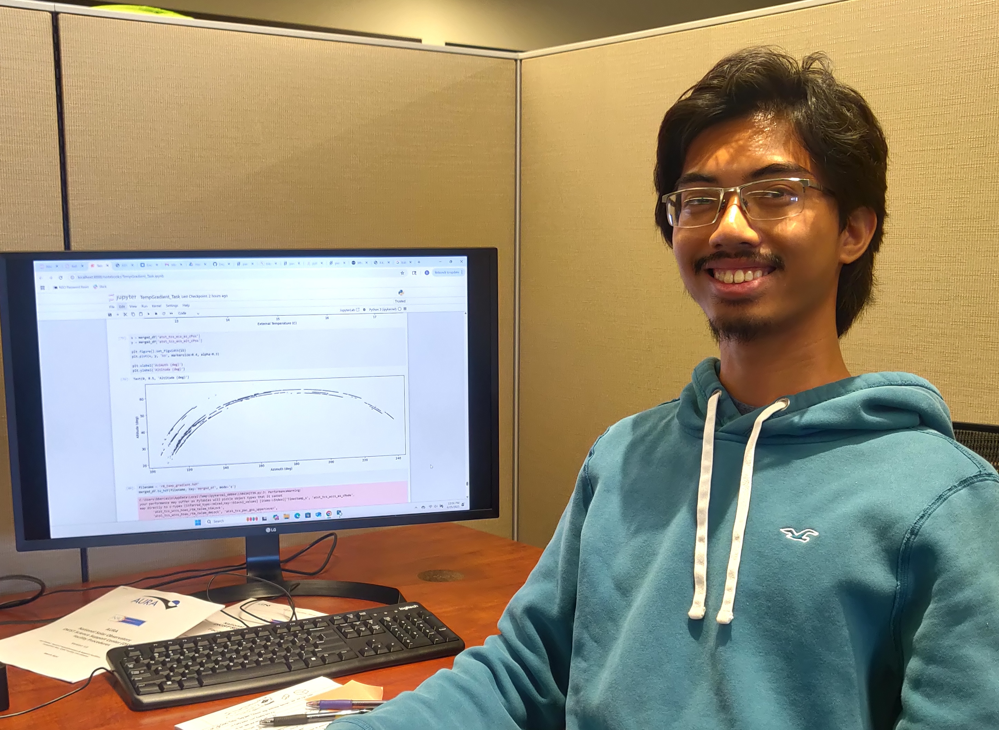
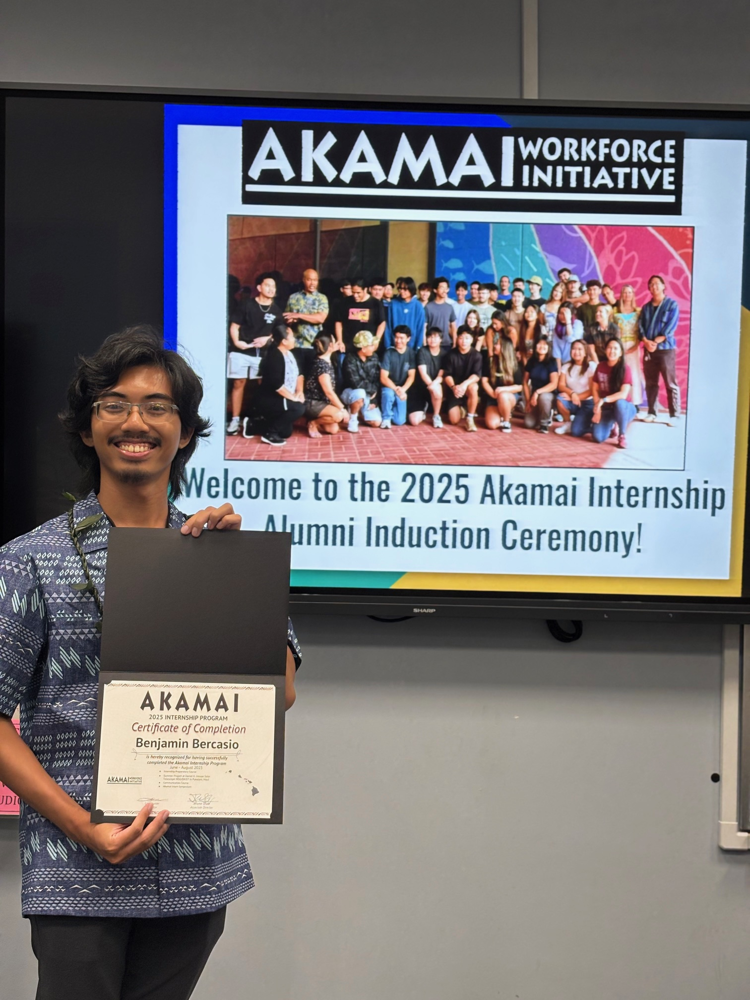

During the summer of 2025, I got the opportunity to learn and apply my computer science skills at the Daniel K. Inoyue Solar Telescope (DKIST) via the Akamai Workforce Initiative. DKIST is a world-class observatory with the largest mirror ever made for solar astronomy, and it was in the tail end of its commissioning phase and transitioning towards full operations. During my time there, under my mentors Anthony Santini and David Morris, I undertook a project titled "Investigating DKIST Enclosure Environmental Effects on Observational Efficacy using Historical Engineering Data". This project entailed processing and analyzing nearly 5 years of engineering data collected daily at a 1Hz cadence in order to investigate any potential links between the enclosure environment and the observatory's observed "image quality". In this context, "image quality" refers to astronomical seeing, the degradation of an image due to atmospheric (both local and higher atmosphere) turbulence which manifests in phenomena such as twinkling, bluriness, and distortion. Data processing and analysis was done primarily in Python using matplotlib, pandas, numpy, and various scripts developed by myself and Anthony Santini to retrieve database data and hasten processing.

My project ultimately yielded an important, statistically signifcant correlation: differences in temperature between the inside and outside of the enclosure greater than 1 degree Celsius correlated with significant drops in peak seeing. Due to ongoing work regarding the topic at the observatory and the sensitive nature of the seeing data itself, I will keep details on exact numbers light. However, it is a correlation that is highly interesting for those in operations due to the potential to maximize good seeing days and thus capture more excellent data for more scientific output. Other parameters were also explored, though any observed potential correlations either lacked sufficient evidence or were confounders. It is important to note that my study does not establish a causative link, which is ultimately a limitation of just analyzing the data.

The overall experience was incredibly fun — I was able to work in a field that's captured my imagination since middle school, and at such an advanced observatory as well. As mentioned previously, my work is just a part of an overall investigation into astonomical seeing at the observatory site, with future projects focused on producing experimental results that could confirm or reject my project's concluding insights. Nonetheless, it is very humbling to be part of the foundation for investigations towards this problem that has very real implications on the future science output of DKIST. It was an awesome opportunity to work with the friendly and hard-working Science Operations team at DKIST, as well as the many other people I met there. I not only got to learn what it means to actually apply my computer science skills to real-world problems, but I got to contribute meaningfully to such a massive, interconnected system as DKIST. For that, I'm incredibly grateful to the people at DKIST and Akamai.