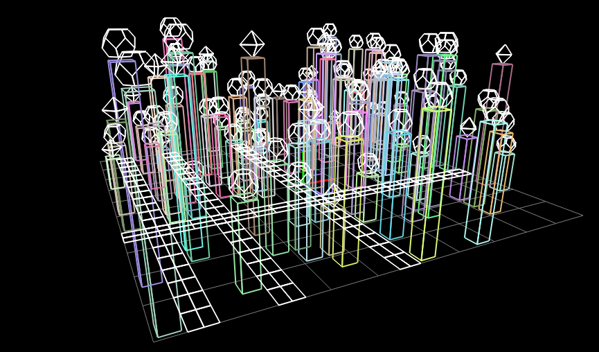
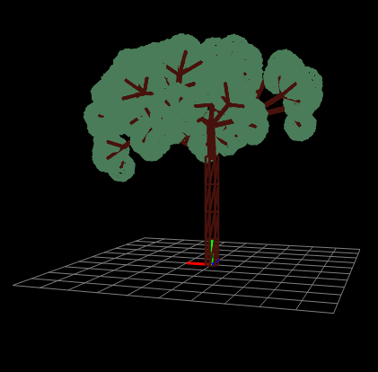

  
  

Over the course of my Intro to Computer Graphics, I developed a OpenGL renderer using Common Lisp. After learning the modern workflow for creating and animating 3D scenes via Maya, we worked to implement various features typical of a 3D rendering application. This includes the creation and usage of transforms (translation, rotation, scale, children), polygons, and polyhedrons. These features are mostly implemented in the immediate mode of OpenGL.

Shown above are various procedurally generated scenes created with my renderer's capabilities. The left image portrays a procedurally generated simple city scene, featuring buildings with random height and polyhedron topper and simple roads. The right image portrays a randomized tree fractal, which takes height, diameter, iterations, and branch number, and outputs a fractal-like tree with leaves generated at the ends of branches.
