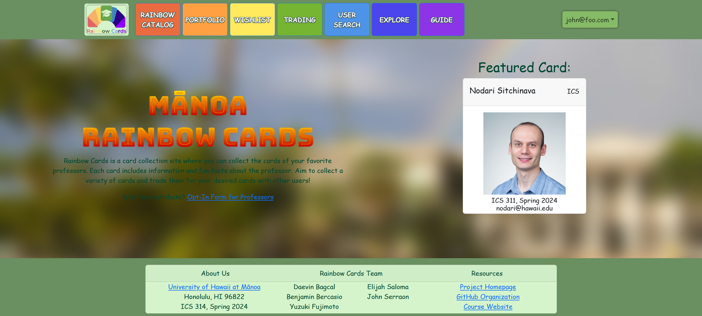

Manoa Rainbow Cards is a website meant to promote student engagement by providing a way for students to learn about their professors. When student begins a course, they can receive a card from their professor which has various details about them. This includes basic information such as the course, semester, and email, but also fun things like fun facts about them or a hidden talent of theirs. It is meant to be fun and lets students learn more about their professor's interests, including possible research opportunities. Students can also give cards to other students they know so that other students can learn more about professors they don't really know yet.

\
\
## My contributions

Other than minor contributions such as the website's logo and the guide page, the majority of my commits to the project were focused on either adding features or fixing features. Many of these involved changes to how the data was stored or adding/editing the data already stored. An example of this was my work on implementing a different way of storing who owned a card. The basis of this work is shown below:

```
import SimpleSchema from 'simpl-schema';

/**
 * The OwnerSchema. This schema defines the object used to store the owners of a given card.
 */

const OwnerSchema = new SimpleSchema({
  name: {
    type: String,
  },
  count: {
    type: Number,
    defaultValue: 0,
  },
});

export default OwnerSchema;
```

This simple schema was used to define the object stored by an array in a given card. Thus, each card holds an array of who owns the card and how many they have. Making sure this feature worked initially required the editing or addition of 10 files, and while not too many lines of code were touched, it was nonetheless difficult. However, it was an incredibly enriching experience that ended up teaching me a lot about MongoDB worked, more so than any lecture.

In general, the features I added tended to be a bit hastily coded and certainly has security vulnerabilities; I was aiming to get the website done by the deadline before anything else. However, I'm still proud that it actually works, that I was able to solve the many problems that I encountered mostly independently. 

If you want to learn more about the project, refer to my team's home page here: [Manoa Rainbow Cards Project Homepage](https://rainbow-cards.github.io/)
