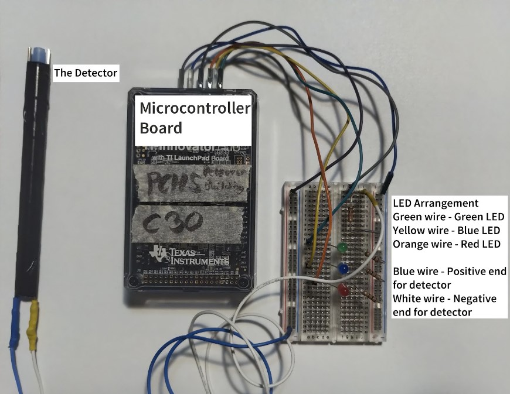

<div class="text-center p-4">
  
</div>

"Detector Building," an event in the high school division of Science Olympiad, involves creating a detector with various parts, including a microcontroller and a breadboard. During this year, it was a salinity detector, which involves creating a device with two electrodes that then measures the conductivity of the water between the two electrodes. The resulting output voltage is then sent back to a microcontroller board, which converts this voltage, using a preprogrammed algorithm, into a salinity level (ppm) and turns on an LED corresponding to a range given on the day of competition.
 
I was in charge of building the detector and programming the algorithm used to calculate the salinity, as well as the code necessary to control the LEDs. I had to learn how a whole new technology set, in the form of the TI-Innovator Hub, as well as how to work with circuits and solder wires together. After hooking everything up and ensuring proper connections, I then had to calibrate the device by preparing upwards of 30 solutions of different salinities and keeping track of the measured voltage level. I plugged this data into Excel, which then gave me an equation fitted to the data. I then programmed the equation into the microcontroller, along with the necessary conversions from analog to digital values and vice versa. An example of the code is shown below.

```
Send ("CONNECT ANALOG.IN 1 TO BB5")
"For 10 seconds, reads and outputs analog input's value, then calculate voltage out
For (n,1,50)
Send ("READ ANALOG.IN 1")
Get (A)
Disp "ANALOG.IN is",A
((A)/(16384))*3.3->V
Disp V
Wait 0.1
End
"Use mathematical model to predict ppm
(35.9e^(3.35x))->P
round(P,0)->P
Disp p
```

The path to the final detector required a revision of the detector itself, which originally used copper electrodes but was upgraded to stainless steel to avoid corosion, as well as many hours of collecting data. This project taught me perseverance and gave me the confidence that I could learn brand new, completely foreign technologies if I put enough effort into the process.

The complete source file for the detector can be found [here](https://raw.githubusercontent.com/mizu-benrb/detectorBuilding_PCHS/main/finalDetect).
